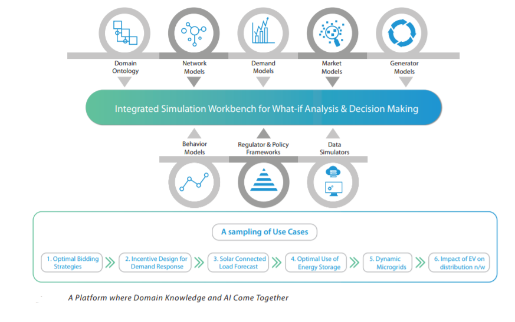

<!-- 
Text can be **bold**, _italic_, or ~~strikethrough~~.

[Link to another page](./another-page.html).

There should be whitespace between paragraphs.

There should be whitespace between paragraphs. We recommend including a README, or a file with information about your project.

# Header 1

This is a normal paragraph following a header. GitHub is a code hosting platform for version control and collaboration. It lets you and others work together on projects from anywhere.

## Header 2

> This is a blockquote following a header.
>
> When something is important enough, you do it even if the odds are not in your favor.

### Header 3

```js
// Javascript code with syntax highlighting.
var fun = function lang(l) {
  dateformat.i18n = require('./lang/' + l)
  return true;
}
```

```ruby
# Ruby code with syntax highlighting
GitHubPages::Dependencies.gems.each do |gem, version|
  s.add_dependency(gem, "= #{version}")
end
```

#### Header 4

*   This is an unordered list following a header.
*   This is an unordered list following a header.
*   This is an unordered list following a header.

##### Header 5

1.  This is an ordered list following a header.
2.  This is an ordered list following a header.
3.  This is an ordered list following a header.

###### Header 6

| head1        | head two          | three |
|:-------------|:------------------|:------|
| ok           | good swedish fish | nice  |
| out of stock | good and plenty   | nice  |
| ok           | good `oreos`      | hmm   |
| ok           | good `zoute` drop | yumm  |

### There's a horizontal rule below this.

* * *

### Here is an unordered list:

*   Item foo
*   Item bar
*   Item baz
*   Item zip

### And an ordered list:

1.  Item one
1.  Item two
1.  Item three
1.  Item four

### And a nested list:

- level 1 item
  - level 2 item
  - level 2 item
    - level 3 item
    - level 3 item
- level 1 item
  - level 2 item
  - level 2 item
  - level 2 item
- level 1 item
  - level 2 item
  - level 2 item
- level 1 item

### Small image


### Large image


### Definition lists can be used with HTML syntax.

<dl>
<dt>Name</dt>
<dd>Godzilla</dd>
<dt>Born</dt>
<dd>1952</dd>
<dt>Birthplace</dt>
<dd>Japan</dd>
<dt>Color</dt>
<dd>Green</dd>
</dl>

```
Long, single-line code blocks should not wrap. They should horizontally scroll if they are too long. This line should be long enough to demonstrate this.
```

```
The final element.
```
 -->
 
 
# Introduction

On a global scale, there is a rapid transformation in electricity industry because of increasing competition, smart grid technologies, renewable technologies, and non-stationary customer preferences. In order to adapt to this uncertain ecosystem, utility based companies need to reorganize their systems and strategies for survivability. Tata Consultancy Services offers a Electricity Value Ecosystem Studio (ELVACS), a comprehensive simulation platform powered by machine learning for utility stakeholders to conduct what-if scenarios to understand the changing ecosystem. This platform models the crucial components in the ecosystem, enabling utility companies to predict the behavior of the ecosystem components to generate business related insights in an economical user-friendly interactive way. 

# Applications of Platform

TCS has been extensively testing this platform's technology through five real-world use cases in electricity industry ecosystem. 
- **Bidding in wholesale electricity markets**:
  In wholesale markets, generators typically place sell orders based on next-day demand estimation, and the market clearing operators determines the clearing price. However, price clearing is dependent on several factors. Moreover, the buy orders made by a large-scale energy suppliers could have momentary lapses leading to significant losses to buyer due to the high trading volumes involved. Therefore, an intelligent adaptive systems serves much better than a human trader.

- **Autonomous agents for retail trading**:
  In the retail industry, there are big industrial plants, large-scale businesses operating in a non-utilities, housing neighborhoods, and small-scale utility companies. They can participate in local scale wholesale energy markets. Therefore, building a efficient solution that incorporates different techniques through which these local utility entities can participate in the wholesale market, revising tariff structures leading to optimal equilibrium between the cost of consumers and the revenue of utility companies. The platform explores autonomous power trading agents based on this platform's technology. These agents operate in a simulated market, automate utility brokers, manage power purchase in a wholesale market, and sell the power to consumers using appropriate tariff structures. These agents participated in an open competition called Power Trading Agent Competition (PowerTAC) 2018, where research groups around the world from both industry and academia compete in multi-agent environment.

- **Dynamic microgrid architectures**:
  The distribution aspect of the utility value chain has a large scope for new architectures because prosumers have bi-directional power flow ability. Therefore, the platfoms visualizes a local self-sustaining microgrids. Although these kinds of grids have been tested across the world, this platform believes in the concept of dynamic microgrids as a prospective solution - autonomous microgrids that re-configure themselves, based on current network conditions. For instance, Line faults and tripping can trigger rearrangement or reorientation in the microgrid so that customer service is not adversely affected. Similarly, a hot sunny day would cause the grid to automatically readjust for increasing the utilization of renewables.

- **Transactive energy modeling**:
  In dynamic micro grids with network reconfiguration, energy consumption and production are two faces of the same coin. Therefore, when some consumers produce more energy that others consume, an automated market mechanism becomes necessary to determine energy exchange price and transaction costs. Note that such market mechanisms are needed even in traditional network architectures to encourage peer-to-peer retail energy trading. Therefore, the platform intends to explore how to leverage cryptocurrency exchanges such as blockchain in innovative retail market models, which belong in a category called the transactive energy model. The platform showcased its work on the TE model at the National Institute for Standards and Technology’s Transactive Energy Modeling and Simulation Challenge in Gaithersburg, where researchers and companies demonstrate their work in power grid simulations.

- **Electric vehicle penetration**:
  A increasingly debated question in developed countries concerns the transition from internal combustion engines to electric vehicles (EVs) and its impact on the power grid. Deeper penetration of this desirable EVs can double up as virtual power plants because they have storage batteries, and EV batteries can be moved from place to place. So, an EV population in a neighborhood can be incentivized for participating in grid transmissions, so that the network does not overload while people can use their EVs at ease. This platform can also help in development of the required market mechanisms for functioning of such complex systems.

  <p align="center">  </p>

# Contributions 
  In the development of this platform, I have mainly contributed to modules concerning the bidding in wholesale electricity markets. 
  1. Application programming interface of Time series forecasting for electricity market entities such as Market demand, Market supply, System demand, and Market Clearing Price.
  2. A generic optimal energy trading agent framework for both buyer and seller in Double-Sided Day-ahead Electricity Spot Markets. These framework has been vigoursly tested on historical data from European Power Exchange Data (EPEX) to analyse and infer the resulting economical aspects such as increased revenue for a seller and decreased cost for a buyer.
  3. A Model of hypothetical large-scale constrained ramping generator has been designed and experimented to understand its operations while minimizing the cost of unsold energy dissipation and maximizing revenue by selling at higher prices.

  _NOTE: There is only limited information regarding the project implementation and no project code here due to TCS confidentiality and Intellectual property rights_

# Research Outcomes
  - Bidding Strategy for Two-Sided Electricity Markets: A Reinforcement Learning based Framework dated Nov 1, 2020 | BuildSys '20: Proceedings of the 7th ACM International Conference on Systems for Energy-Efficient Buildings, Cities, and Transportation (https://dl.acm.org/doi/10.1145/3408308.3427976)

# References
  https://www.tcs.com/reimagining-research/power-platform
